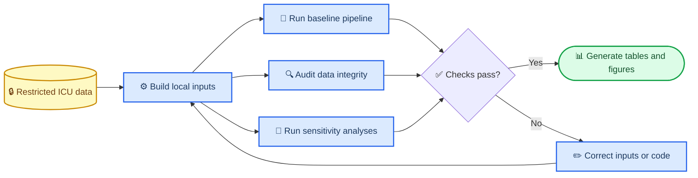

# SA-AKI Longitudinal Subphenotyping

[](https://www.python.org/downloads/)
[](LICENSE)
[](#associated-manuscript)

Reproducible analysis code for trajectory-defined subphenotypes of sepsis-associated acute kidney injury (SA-AKI) across MIMIC-IV, eICU-CRD, and AmsterdamUMCdb.

This repository combines the curated analysis package used for the submitted study with the additional data-audit and sensitivity-analysis code developed during peer-review revision. It contains **code only**: no patient-level data, fitted patient assignments, model artifacts, or manuscript results are included.

## Associated manuscript

**Working title:** “Longitudinal subphenotypes in sepsis-associated acute kidney injury patients with distinct kidney injury trajectories and diuretic therapy responses.”

The manuscript is under revision at the *Journal of Translational Internal Medicine*. Bibliographic fields will be updated after a final editorial decision. Code in `revision_analysis/` should therefore be read as revision-stage analytical material, not as evidence of journal acceptance.

## Scope and interpretation

The repository supports:

- construction and visualization of longitudinal clinical feature windows;
- three-component longitudinal mixture modeling with `mixAK`;
- cohort comparison, outcome modeling, and classifier evaluation;
- auditable regeneration of longitudinal supplementary tables;
- sensitivity analyses added in response to reviewer comments.

The code does **not** provide a turnkey extraction pipeline from raw EHR databases. It expects locally prepared, study-specific tables derived under each database's data-use agreement. The diuretic analyses are exploratory associations, and the classifier analyses are retrospective validation analyses; neither supports bedside treatment assignment or clinical deployment.

## Analysis workflow



## Repository structure

```text
.
├── src/sa_aki_pipeline/      # Reusable baseline analysis package
├── scripts/                  # Baseline command-line entry points
├── configs/                  # Configuration templates
├── tests/                    # Unit tests for reusable components
├── revision_analysis/        # Data audit and revision-stage analyses
├── docs/                     # Public input contracts and provenance notes
├── pyproject.toml
└── requirements.txt
```

The baseline package was consolidated from the earlier public development repository, [shen-lab-icu/SAKI-Longitudinal-Subphenotyping](https://github.com/shen-lab-icu/SAKI-Longitudinal-Subphenotyping). This repository preserves that provenance while adding the independently organized revision analyses.

## Quick start

### Requirements

- Python 3.10 or newer
- R with `mixAK` and `coda` for the clustering sensitivity analysis
- authorized local access to the relevant ICU datasets for full reproduction

### Install

```bash
git clone https://github.com/HaibooZhu/SA-AKI-Longitudinal-Subphenotyping.git
cd SA-AKI-Longitudinal-Subphenotyping

python3 -m venv .venv
source .venv/bin/activate
python -m pip install --upgrade pip
python -m pip install -e ".[revision,dev]"
```

### Verify the reusable package

```bash
PYTHONPATH=src pytest -q
```

### Inspect available commands

```bash
python scripts/generate_time_windows.py --help
python revision_analysis/07_tables_figures/regenerate_supplementary_tables.py --help
```

All public revision scripts require the caller to supply input paths explicitly. Generated files default to `results/`, which is ignored by Git. See [the revision workstream guide](revision_analysis/README.md) and [the input-data contract](docs/INPUT_DATA_CONTRACT.md) before running them.

## Baseline analysis entry points

| Script | Purpose |
| --- | --- |
| `generate_time_windows.py` | Build cohort-specific longitudinal feature windows |
| `run_mixak_clustering.py` | Run the `mixAK` longitudinal mixture model |
| `run_time_stats.py` | Calculate standardized clinical time intervals |
| `run_psm.py` | Run propensity-score matching with balance diagnostics |
| `run_diuretic_psm.py` | Reproduce the archived three-group matching workflow |
| `run_sepsis_aki_timing.py` | Analyze sepsis-to-AKI timing |
| `train_model.py` | Train the retrospective phenotype classifier |
| `compute_shap.py` | Calculate SHAP-based model explanations |

The YAML files in `configs/` are templates. Copy one to a local, ignored configuration file and replace example paths with authorized local inputs.

## Revision analyses

| Directory | Revision purpose | Review mapping |
| --- | --- | --- |
| `01_data_audit/` | Trace Supplementary Table S3 from source matrix to workbook values | Editor E.1; Reviewer 1 major comment 3 |
| `02_missingness_sensitivity/` | Rebuild eICU urine-output documentation scenarios | Editor E.2; Reviewer 1 major comment 4 |
| `03_cluster_robustness/` | Refit, align, and quantify assignment stability and uncertainty | Editor E.2 |
| `04_independent_outcomes/` | Estimate adjusted clinical outcome associations | Editor E.3 |
| `05_diuretic_exploratory/` | Audit and restrict the post-exposure diuretic analysis | Editor E.4; Reviewer 1 major comment 1 |
| `06_classifier_validation/` | Revalidate discrimination, class balance, and calibration | Editor E.5; Reviewer 1 major comment 2 |
| `07_tables_figures/` | Regenerate harmonized longitudinal supplementary tables | Data-integrity revision |
| `08_literature_update/` | Archive reproducible PubMed searches used in the revision | Literature update |

## Data access and privacy

No study data are distributed here. Researchers must obtain access independently and comply with each resource's data-use agreement:

- [MIMIC-IV on PhysioNet](https://physionet.org/content/mimiciv/)
- [eICU Collaborative Research Database on PhysioNet](https://physionet.org/content/eicu-crd/)
- [AmsterdamUMCdb](https://github.com/AmsterdamUMC/AmsterdamUMCdb)

Do not commit credential files, local path configuration, patient identifiers, derived patient-level tables, model artifacts trained on restricted data, or generated outputs. The repository's `.gitignore` blocks common data and model formats as an additional safeguard, but it does not replace manual review.

## Reproducibility notes

- Random seeds are declared in the relevant scripts or configuration objects.
- Revision scripts write reports, plots, and tabular results to a caller-controlled output directory.
- `run_mixak_k3_sensitivity.R` preserves posterior probabilities on their native 0–1 scale; no division by two is applied.
- Numeric mixture labels are aligned to archived phenotypes before agreement statistics are calculated.
- Data-audit outputs distinguish source-data discrepancies from workbook-rendering discrepancies.

## License

Code is released under the [MIT License](LICENSE). Dataset licenses and data-use agreements remain separate and controlling.

## Citation

Until the manuscript has final bibliographic information, cite the software repository and the exact Git commit used. A journal citation and archived release will be added after publication.

## Contact and issues

Please use the [GitHub issue tracker](https://github.com/HaibooZhu/SA-AKI-Longitudinal-Subphenotyping/issues) for reproducible code problems. Never attach restricted clinical data to an issue.

---

_Last updated: 2026-08-09_
