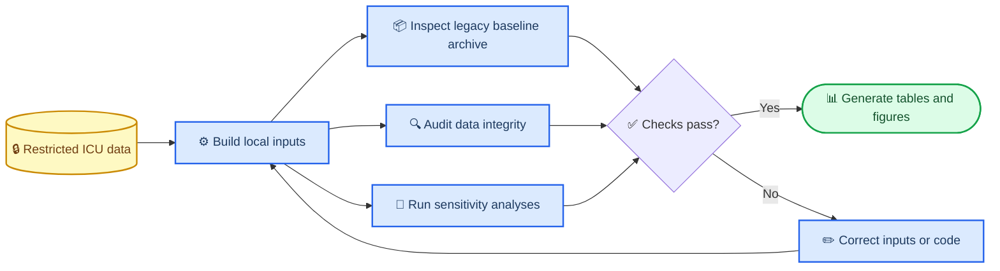

# SA-AKI Longitudinal Subphenotyping

[](https://www.python.org/downloads/)
[](LICENSE)
[](#associated-manuscript)

Reproducible analysis code for trajectory-defined subphenotypes of sepsis-associated acute kidney injury (SA-AKI) across MIMIC-IV, eICU-CRD, and AmsterdamUMCdb.

This repository preserves the historical public pipeline and adds the independent data-audit and sensitivity-analysis code developed during peer-review revision. It contains code plus a whitelisted bundle of **aggregate, identifier-free revision evidence**; no patient-level data, fitted patient assignments, or restricted model artifacts are included. The historical `src/`, `scripts/`, and `configs/` tree is retained for provenance and is **not the authoritative executable basis for revision claims**; use `revision_analysis/` for the corrected revision workflows.

## Associated manuscript

**Current manuscript title:** “Kidney-Function Trajectory Subphenotypes of Sepsis-Associated Acute Kidney Injury Under the ADQI 28 Definition: A Multicenter Cohort Study.”

The manuscript is under revision at the *Journal of Translational Internal Medicine*. Bibliographic fields will be updated after a final editorial decision. Code in `revision_analysis/` should therefore be read as revision-stage analytical material, not as evidence of journal acceptance.

## Scope and interpretation

The repository supports:

- construction and visualization of longitudinal clinical feature windows;
- three-component longitudinal mixture modeling with `mixAK`;
- cohort comparison, outcome modeling, and classifier evaluation;
- auditable regeneration of longitudinal supplementary tables;
- sensitivity analyses added in response to reviewer comments.

The code does **not** provide a turnkey extraction pipeline from raw EHR databases. It expects locally prepared, study-specific tables derived under each database's data-use agreement. The diuretic analyses are exploratory associations, and the classifier analyses are retrospective validation analyses; neither supports bedside treatment assignment or clinical deployment.

## Analysis workflow


```mermaid
flowchart LR
    accTitle: SA-AKI Analysis Workflow
    accDescr: Restricted ICU data are transformed into local harmonized inputs, analyzed by the baseline pipeline and revision workstreams, then checked before tables and figures are generated

    restricted[(🔒 Restricted ICU data)] --> harmonize[⚙️ Build local inputs]
    harmonize --> baseline[📦 Inspect legacy baseline archive]
    harmonize --> audit[🔍 Audit data integrity]
    harmonize --> sensitivity[🧪 Run sensitivity analyses]
    baseline --> verify{✅ Checks pass?}
    audit --> verify
    sensitivity --> verify
    verify -->|Yes| outputs([📊 Generate tables and figures])
    verify -->|No| revise[✏️ Correct inputs or code]
    revise --> harmonize

    classDef restricted_style fill:#fef9c3,stroke:#ca8a04,stroke-width:2px,color:#713f12
    classDef process_style fill:#dbeafe,stroke:#2563eb,stroke-width:2px,color:#1e3a5f
    classDef output_style fill:#dcfce7,stroke:#16a34a,stroke-width:2px,color:#14532d

    class restricted restricted_style
    class harmonize,baseline,audit,sensitivity,revise process_style
    class outputs output_style
```

## Repository structure

```text
.
├── src/sa_aki_pipeline/      # Frozen legacy public package; provenance only
├── scripts/                  # Historical entry points; non-authoritative
├── configs/                  # Historical templates; not a methods contract
├── tests/                    # Unit tests for reusable components
├── revision_analysis/        # Data audit and revision-stage analyses
├── original_pipeline/        # Original analysis notebooks cited in Supplementary Data 1 (outputs removed)
├── aggregate_results/        # Whitelisted identifier-free revision evidence
├── docs/                     # Public input contracts and provenance notes
├── pyproject.toml
└── requirements.txt
```

The legacy package was consolidated from the earlier public development repository, [shen-lab-icu/SAKI-Longitudinal-Subphenotyping](https://github.com/shen-lab-icu/SAKI-Longitudinal-Subphenotyping). It is intentionally left unchanged so its provenance remains inspectable; the revision analyses in `revision_analysis/` replace it where the two differ.

## Quick start

### Requirements

- Python 3.10 or 3.11 (the archived AutoGluon dependency set is not compatible with newer Python versions); the September 2026 classifier refits in `revision_analysis/06_classifier_validation/autogluon_2026092*` used Python 3.12 with AutoGluon 1.6.3
- R with `mixAK` and `coda` for the clustering sensitivity analysis
- authorized local access to the relevant ICU datasets for full reproduction

### Install

```bash
git clone https://github.com/HaibooZhu/SA-AKI-Longitudinal-Subphenotyping.git
cd SA-AKI-Longitudinal-Subphenotyping

python3 -m venv .venv
source .venv/bin/activate
python -m pip install --upgrade pip
python -m pip install -e ".[revision,dev]"
```

### Verify the reusable package

```bash
PYTHONPATH=src pytest -q
```

### Inspect the authoritative revision commands

```bash
python revision_analysis/02_missingness_sensitivity/build_corrected_time_grid.py --help
python revision_analysis/03_cluster_robustness/summarize_deep_k_stability.py --help
python revision_analysis/07_tables_figures/regenerate_supplementary_tables.py --help
```

All public revision scripts that consume study data require the caller to supply those input paths explicitly. Generated files default to `results/`, which is ignored by Git. See [the revision workstream guide](revision_analysis/README.md) and [the input-data contract](docs/INPUT_DATA_CONTRACT.md) before running them.

The published [aggregate revision evidence](aggregate_results/README.md) includes audit status files, summary tables, and the polished revision figures in SVG, PDF, 600-dpi TIFF, and PNG formats. Its manifest records the exact public file set; patient-level inputs and assignments are deliberately excluded.

## Historical baseline entry points

> **Provenance warning:** The commands below are retained to document the earlier public implementation. They contain known issues and must not be used to regenerate revision results. They are not being silently rewritten because the project keeps original code frozen; corrected logic lives under `revision_analysis/`.

| Script | Purpose |
| --- | --- |
| `generate_time_windows.py` | Build cohort-specific longitudinal feature windows |
| `run_mixak_clustering.py` | Run the `mixAK` longitudinal mixture model |
| `run_time_stats.py` | Calculate standardized clinical time intervals |
| `run_psm.py` | Run propensity-score matching with balance diagnostics |
| `run_diuretic_psm.py` | Reproduce the archived three-group matching workflow |
| `run_sepsis_aki_timing.py` | Analyze sepsis-to-AKI timing |
| `train_model.py` | Train the retrospective phenotype classifier |
| `compute_shap.py` | Calculate SHAP-based model explanations |

The YAML files in `configs/` are historical templates, not the authoritative specification of the revised methods. In particular, they must not be used to infer the verified eICU urine-output aggregation rule. The revision scripts in `revision_analysis/` implement the verified rule.

## Revision analyses

| Directory | Revision purpose | Review mapping |
| --- | --- | --- |
| `00_data_lineage/` | Lock the authoritative eICU cohort and detect mixed historical exports without releasing identifiers | Editor E.1 |
| `01_data_audit/` | Trace Supplementary Table S3 from source matrix to workbook values; rebuild the eICU discharge rows of Table 1; build the study variable list (Supplementary Data 1) | Editor E.1; Reviewer 1 major comment 3 |
| `02_missingness_sensitivity/` | Audit cross-cohort inputs, rebuild the complete time grid, and create eICU urine-output scenarios | Editor E.2; Reviewer 1 major comment 4 |
| `03_cluster_robustness/` | Audit traceable k candidates; run screening K=2–5 and deep K=2/K=3 multi-initialization experiments; rerun every CAUTION and urine-documentation scenario; extended-sampling refits of the primary analysis and processing scenarios (Tables S15 and S17A) with the K=2 versus K=3 comparison | Editor E.2; Reviewer 1 major comment 4 |
| `04_independent_outcomes/` | Estimate adjusted clinical outcome associations including onset nonrenal SOFA | Editor E.3 |
| `05_diuretic_exploratory/` | Audit and restrict the post-exposure diuretic analysis | Editor E.4; Reviewer 1 major comment 1 |
| `06_classifier_validation/` | Replay the archived model; refit the first-24-hour classifier with harmonized units and evaluate six cumulative observation windows (Figure 5, Figures S7–S8, Tables S19–S20) | Editor E.5; Reviewer 1 major comment 2 |
| `07_tables_figures/` | Regenerate harmonized tables and publication figures, including Table 1, Tables S3–S5 and Table S1/Figure S2; enforce figure export and visual-review contracts | Data-integrity and figure QA |
| `08_literature_update/` | Archive reproducible PubMed searches used in the revision | Literature update |
| `09_revision_documents/` | Fail-closed document, numerical-consistency, and reviewer-response traceability QA | Final submission QA |
| `10_documentation_selection/` | Summarize urine-output documentation in eICU-CRD and the patients retained under documentation thresholds, supporting Table S15 (`build_table_s20.py` keeps its working name) | Editor E.2 |

## September 2026 update

- Added the code for the analyses in the current revision: extended-sampling refits and their audit (`03_cluster_robustness/`: `launch_w21.sh`, `run_mixak_converged_refit.R`, `audit_recovered_w21_20260908.py`, `k2_k3_crosstab_w21.py`), the classifier refits (`06_classifier_validation/autogluon_20260921/`, `autogluon_20260922_unit_refit/`), Table 1, Tables S1, S3–S5 and Figure S2 (`07_tables_figures/`, `01_data_audit/`), the urine-output documentation summaries (`10_documentation_selection/`) and the study variable list (`01_data_audit/build_variable_list_20260923_087.py`).
- Server host names, user names and absolute paths were replaced by `~/` or by environment variables (`JTIM_SSH_HOST`, `JTIM_SSH_PORT`); the scripts are otherwise the versions that were run.
- `original_pipeline/` contains the original analysis notebooks cited in Supplementary Data 1, which refers to cells by position. Outputs were removed and one patient identifier in a code comment was deleted. The notebooks ran on the authors' server against credentialed data and cannot run without it.
- The field `mortality_28d` in the original pipeline records death within 30 days after SA-AKI onset; the manuscript reports it as 30-day mortality.
- Internal audit and quality-control notes are kept in the private project; `aggregate_results/` retains summary tables, status files and figures.

## Data access and privacy

No study data are distributed here. Researchers must obtain access independently and comply with each resource's data-use agreement:

- [MIMIC-IV on PhysioNet](https://physionet.org/content/mimiciv/)
- [eICU Collaborative Research Database on PhysioNet](https://physionet.org/content/eicu-crd/)
- [AmsterdamUMCdb](https://github.com/AmsterdamUMC/AmsterdamUMCdb)

Do not commit credential files, local path configuration, patient identifiers, derived patient-level tables, model artifacts trained on restricted data, or generated outputs. The repository's `.gitignore` blocks common data and model formats as an additional safeguard, but it does not replace manual review.

## Reproducibility notes

- Random seeds are declared in the relevant scripts or configuration objects.
- Revision scripts write reports, plots, and tabular results to a caller-controlled output directory.
- `run_mixak_refit.R` preserves posterior probabilities on their native 0–1 scale; no division by two is applied.
- Deep confirmation uses all prespecified starts (three cohorts × K=2/3 × three starts; six CAUTION scenarios × three starts; two eICU urine-documentation scenarios × three starts). Degenerate or poorly mixing results remain in the denominator.
- Chains are not pooled without label alignment, because label switching invalidates direct pooling; split R-hat (Table S17A) is computed after aligning component labels across initializations, and labels are aligned before cross-start agreement, ARI, and NMI are calculated.
- The ≥50% urine-output coverage scenario uses the fixed 30-window denominator, not the number of available rows.
- Numeric mixture labels are aligned to archived phenotypes before agreement statistics are calculated.
- Data-audit outputs distinguish source-data discrepancies from workbook-rendering discrepancies.
- Table S1 is checked cell for cell against its aggregate source CSV; embedded Figure S2 is checked against the released asset by SHA-256 with a pixel-comparison fallback.
- The final numerical audit maps aggregate source results to repeated manuscript, supplement, and response-letter locations; detailed extracted prose remains private and is not published.
- Figure QA requires editable SVG, valid PDF, 600-dpi TIFF, and preview PNG exports for Figures S2 and S10–S14, together with a recorded visual review for readability, clipping, overlap, and color semantics.
- Patient-level assignments and prediction files are intentionally excluded from version control; public outputs must remain aggregate-only.
- Archived classifier replay requires the frozen legacy environment in [`environment.archived-autogluon.yml`](environment.archived-autogluon.yml), not the current package defaults.
- Data-free unit tests run automatically in GitHub Actions; full clinical analyses require authorized local data and therefore are not executed in public CI.

## License

Code is released under the [MIT License](LICENSE). Dataset licenses and data-use agreements remain separate and controlling.

## Citation

Until the manuscript has final bibliographic information, cite the software repository and the exact Git commit used. A journal citation and archived release will be added after publication.

## Contact and issues

Please use the [GitHub issue tracker](https://github.com/HaibooZhu/SA-AKI-Longitudinal-Subphenotyping/issues) for reproducible code problems. Never attach restricted clinical data to an issue.

---

_Last updated: 2026-09-27_
