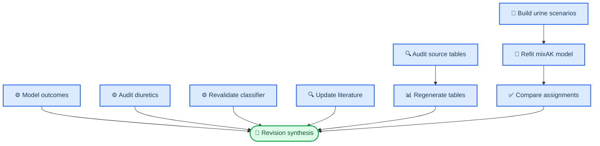

# Revision analysis workstreams

This directory contains the code added during the JTIM major revision. It is deliberately separated from the baseline package so that the submitted workflow and the reviewer-requested analyses remain traceable.

## Safety boundary

- No patient-level input, generated result, fitted model, or workbook is stored here.
- Every analysis input must be supplied as a command-line path.
- Outputs default to `results/revision/` or must be supplied explicitly.
- Run the scripts only with data held under the corresponding database authorization and data-use agreement.

## Workstream map

| Directory | Purpose | Main output |
| --- | --- | --- |
| `01_data_audit/` | Extract workbook cells and audit Supplementary Table S3 against source and generated tables | discrepancy tables and audit report |
| `02_missingness_sensitivity/` | Construct documented-window and high-coverage eICU urine-output scenarios | scenario-specific longitudinal CSV files |
| `03_cluster_robustness/` | Refit the three-component model and compare aligned assignments | agreement metrics, uncertainty, and trajectory plots |
| `04_independent_outcomes/` | Fit adjusted mortality and RRT association models | effect tables and forest plot |
| `05_diuretic_exploratory/` | Audit archived matching and run a restricted landmark analysis | balance, descriptive, and interaction summaries |
| `06_classifier_validation/` | Refit a fixed XGBoost sensitivity model and assess calibration | balanced metrics, bootstrap intervals, and plots |
| `07_tables_figures/` | Apply harmonization rules and regenerate longitudinal tables | tidy data dictionary and Tables S3–S5 |
| `08_literature_update/` | Re-run and archive predefined PubMed searches | JSON, CSV, and protocol record |

## Typical execution order



## Example commands

The following examples show interfaces, not distributable input locations.

```bash
# 1. Extract values from the supplementary workbooks.
python revision_analysis/01_data_audit/extract_workbook_json.py \
  --output-dir results/revision/workbook_json \
  /authorized/path/Workbook1.xlsx \
  /authorized/path/Workbook2.xlsx \
  /authorized/path/Workbook3.xlsx

# 2. Audit Table S3 from source matrix through workbook rendering.
python revision_analysis/01_data_audit/audit_table_s3.py \
  --source-matrix /authorized/path/df_saki_timeseries_feature_all.csv \
  --generated-dir /authorized/path/generated_tables \
  --workbook-json-dir results/revision/workbook_json \
  --output-dir results/revision/table_s3_audit

# 3. Build urine-output sensitivity scenarios.
python revision_analysis/02_missingness_sensitivity/build_eicu_uo_scenarios.py \
  --events /authorized/path/eicu_urine_events.csv \
  --onsets /authorized/path/eicu_saki_onsets.csv \
  --cluster-input /authorized/path/eicu_cluster_input.csv \
  --output-dir results/revision/urine_scenarios

# 4. Refit and evaluate one clustering scenario.
Rscript revision_analysis/03_cluster_robustness/run_mixak_k3_sensitivity.R \
  results/revision/urine_scenarios/eicu_documented_windows.csv \
  results/revision/cluster_robustness documented_windows 20260805

python revision_analysis/03_cluster_robustness/evaluate_cluster_sensitivity.py \
  --scenario documented_windows \
  --scenario-input results/revision/urine_scenarios/eicu_documented_windows.csv \
  --original-data /authorized/path/df_mixAK_fea4_C3_eicu.csv \
  --result-dir results/revision/cluster_robustness
```

The remaining scripts expose their full input contract through `--help`. Detailed expected file layouts are recorded in [`docs/INPUT_DATA_CONTRACT.md`](../docs/INPUT_DATA_CONTRACT.md).

## Interpretation guardrails

- Posterior membership probabilities are already on the 0–1 scale and must not be divided by two.
- A patient is marked uncertain when the 95% HPD lower bound for the assigned component does not exceed 0.5.
- Mixture-component numbers are arbitrary; align labels before calculating agreement, ARI, or NMI.
- The adjusted outcome models estimate associations, not causal effects.
- The diuretic workstream is exploratory because treatment indication and post-exposure classification can introduce bias.
- The classifier workstream evaluates retrospective discrimination and calibration, not clinical readiness.
